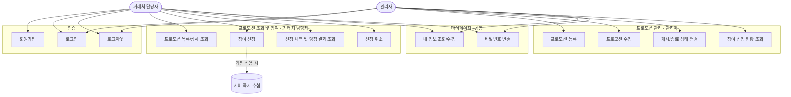

# 유스케이스 다이어그램 - b2b-promo

`1-domain-definition.md` 4장(유스케이스)을 기반으로 작성.

```mermaid
graph TB
    Admin([관리자])
    Buyer([거래처 담당자])

    subgraph 인증
        UC1[회원가입]
        UC2[로그인]
        UC13[로그아웃]
    end

    subgraph 프로모션 관리 - 관리자
        UC3[프로모션 등록]
        UC4[프로모션 수정]
        UC5[게시/종료 상태 변경]
        UC6[참여 신청 현황 조회]
    end

    subgraph 프로모션 조회 및 참여 - 거래처 담당자
        UC7[프로모션 목록/상세 조회]
        UC8[참여 신청]
        UC9[신청 내역 및 당첨 결과 조회]
        UC10[신청 취소]
    end

    subgraph 마이페이지 - 공통
        UC11[내 정보 조회/수정]
        UC12[비밀번호 변경]
    end

    UC8b[(서버 즉시 추첨)]

    Buyer --> UC1
    Buyer --> UC2
    Admin --> UC2
    Buyer --> UC13
    Admin --> UC13

    Admin --> UC3
    Admin --> UC4
    Admin --> UC5
    Admin --> UC6

    Buyer --> UC7
    Buyer --> UC8
    Buyer --> UC9
    Buyer --> UC10

    UC8 -.게임 적용 시.-> UC8b

    Admin --> UC11
    Admin --> UC12
    Buyer --> UC11
    Buyer --> UC12
```
