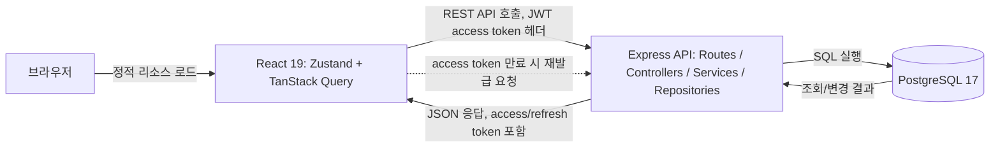
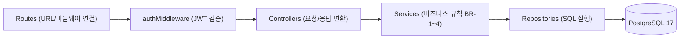
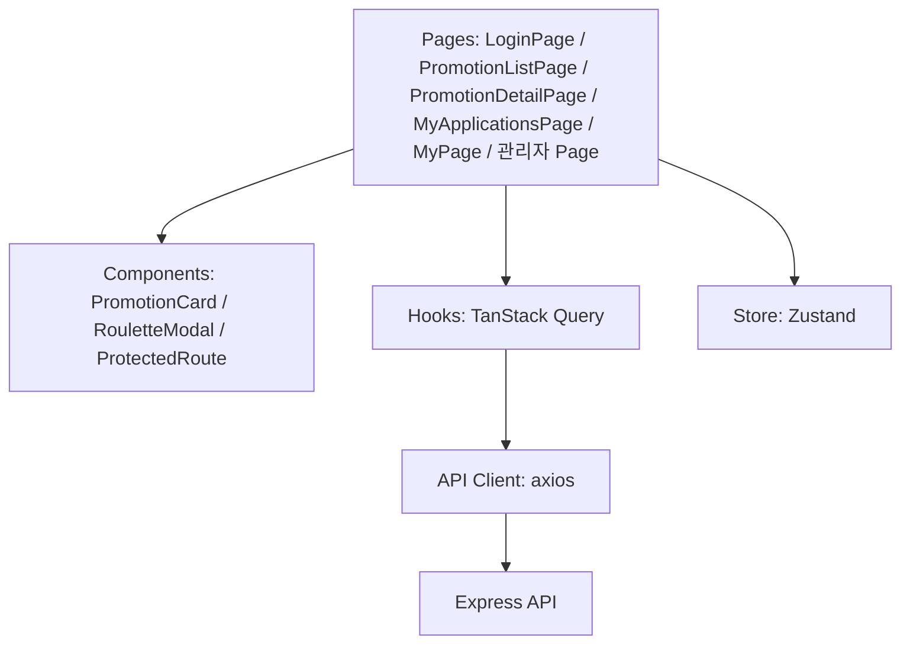

# 기술 아키텍처 다이어그램 - b2b-promo

## 변경 이력

| 버전 | 날짜 | 변경 내용 |
|---|---|---|
| 1.0 | 2026-08-13 | 최초 작성 |
| 1.1 | 2026-08-13 | 다이어그램 1 구문 오류 수정, 프론트엔드 컴포넌트 구조 다이어그램 추가 |

## 1. 전체 시스템 구성도

브라우저 - 프론트엔드(React) - 백엔드(Express API) - PostgreSQL 흐름과 JWT 인증 흐름을 나타낸다.

## 2. 백엔드 요청 처리 계층 흐름

`5-project-principle.md`의 라우트-컨트롤러-서비스-DB접근 4계층 원칙을 그대로 반영한다. 하위 계층은 상위 계층을 참조하지 않는다.

## 3. 프론트엔드 컴포넌트 구조

`5-project-principle.md`의 pages/components/hooks/store/api 구조를 그대로 반영한다. 컴포넌트는 훅을 통해서만 데이터에 접근한다.

