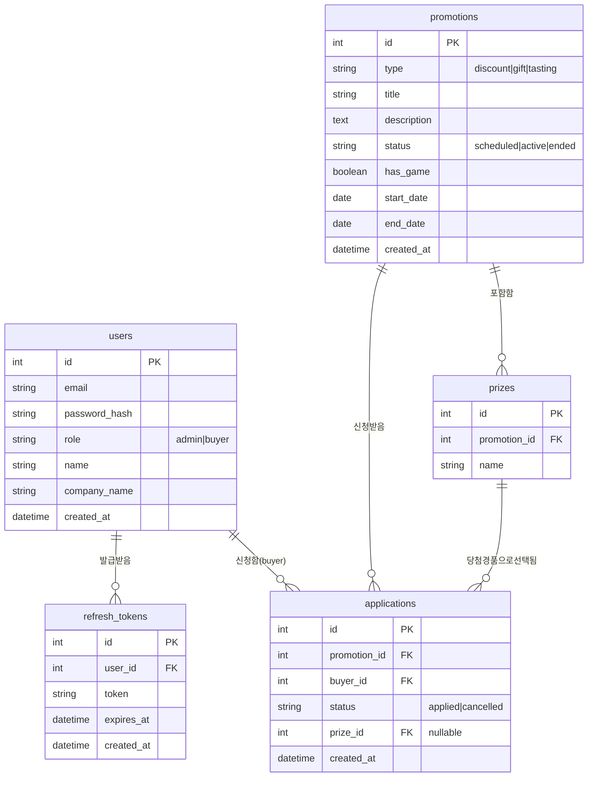

# ERD - b2b-promo

## 변경 이력

| 버전 | 날짜 | 변경 내용 |
|---|---|---|
| 1.0 | 2026-08-13 | 최초 작성 |
| 1.1 | 2026-08-13 | refresh_tokens 테이블 추가 (FR-1.4, FR-1.5 구현에 필요) |

## 엔티티-관계 다이어그램

## 제약사항

- `applications`: `UNIQUE(promotion_id, buyer_id)` — BR-1(참여신청은 프로모션·거래처 조합당 유일). 취소 후 재신청은 이 유니크 제약 하에서 기존 레코드의 `status`를 갱신하는 방식으로 처리한다.
- `applications.prize_id`는 `has_game = true`인 프로모션의 신청 건에만 값이 채워지며, 그 외에는 `NULL`이다. 값은 신청 시 1회만 기록되고 이후 변경하지 않는다 (BR-2).
- `prizes.promotion_id`는 NOT NULL — 경품은 반드시 프로모션에 종속되며, 게임 미적용 프로모션은 경품 레코드를 갖지 않는다.
- `refresh_tokens.token`은 UNIQUE — 재발급 시 기존 레코드를 삭제하고 새로 발급(로테이션), 로그아웃 시 삭제해 무효화한다 (FR-1.4, FR-1.5). `user_id` 삭제 시 함께 삭제된다(ON DELETE CASCADE).

## 설계 노트

- `users`는 관리자/거래처 담당자를 `role` 컬럼 하나로 구분해 단일 테이블로 통합했다. 두 액터의 속성 차이가 크지 않아 테이블 분리는 오버엔지니어링이다.
- `promotions.status`, `applications.status`는 별도 상태 테이블 없이 문자열 enum성 컬럼으로 처리한다. 상태 종류가 각각 3개/2개로 고정되어 있어 정규화 이득이 없다.
- 프로모션 등록자(관리자) 추적 컬럼은 MVP 요구사항(도메인 정의서 3장)에 명시되지 않아 생략했다. 필요 시 `promotions.created_by`(FK to users)로 확장 가능하다.
- `refresh_tokens`는 도메인 엔티티가 아니라 인증 구현을 위한 테이블이지만, FR-1.4(토큰 재발급)/FR-1.5(로그아웃 시 무효화)를 서버에서 검증하려면 저장소가 필요해 포함했다. 도메인 정의서 3장의 핵심 엔티티 4종과는 구분된다.
