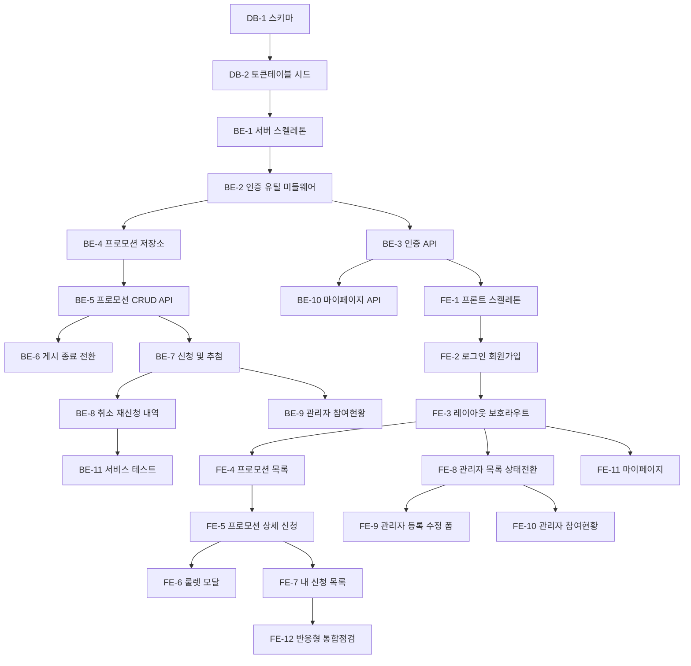

# 구현 실행계획 - b2b-promo

## 변경 이력

| 버전 | 날짜 | 변경 내용 |
|---|---|---|
| 1.0 | 2026-08-13 | 최초 작성 |
| 1.1 | 2026-08-13 | docs 간 정합성 점검 반영: 권한 없음 응답을 403으로 통일(BE-1/BE-5/BE-9), BE-8에 취소/재신청 엔드포인트 경로 명시(swagger.json과 정합) |

## 문서 목적

`1-domain-definition.md` ~ `8-schema.sql`을 바탕으로 3일/1인 MVP 개발을 위한 Task를 데이터베이스/백엔드/프론트엔드 단위로 분해한다. 총 25개 Task이며, 각 Task는 독립적으로 착수·검증 가능한 단위로 정의한다.

---

## Task 의존 관계 요약

| 구분 | Task 수 | 범위 |
|---|---|---|
| 데이터베이스 | 2 | DB-1 ~ DB-2 |
| 백엔드 | 11 | BE-1 ~ BE-11 |
| 프론트엔드 | 12 | FE-1 ~ FE-12 |

---

## 1. 데이터베이스

### DB-1. 핵심 4테이블 마이그레이션 작성

- **수행 작업**: `8-schema.sql` 내용을 `backend/src/db-migrations/`에 엔티티별로 분리해 작성한다 — `001_create_users.sql`, `002_create_promotions.sql`, `003_create_prizes.sql`, `004_create_applications.sql`. 컬럼명/상태값은 `5-project-principle.md` 3절 네이밍 규칙(`snake_case`, `scheduled|active|ended`, `applied|cancelled`)을 그대로 따른다.
- **선행 Task**: 없음
- **완료 조건**:
  - [x] 4개 마이그레이션 파일을 순서대로 실행하면 users/promotions/prizes/applications 테이블이 오류 없이 생성된다
  - [x] `applications`에 `UNIQUE(promotion_id, buyer_id)` 제약이 존재한다 (BR-1)
  - [x] `promotions.status` 기본값이 `scheduled`이고 CHECK 제약으로 3개 값만 허용한다 (BR-4)
  - [x] `applications.prize_id`가 NULL 허용이며 `prizes(id)`를 참조한다 (BR-2)

### DB-2. refresh token 테이블 및 관리자 시드

- **수행 작업**: `backend/src/db-migrations/005_create_refresh_tokens.sql`(user_id FK, token, expires_at)과 `seed_admin.sql`(bcrypt 해시된 관리자 계정 1건, role='admin')을 작성한다. `backend/package.json`에 마이그레이션 일괄 실행 npm script를 추가한다.
- **선행 Task**: DB-1
- **완료 조건**:
  - [x] npm script 한 번 실행으로 전체 마이그레이션 + 시드가 적용된다
  - [x] 시드된 관리자 계정으로 조회 시 `role='admin'`이고 `password_hash`가 평문이 아니다 (FR-1.0)
  - [x] refresh token 레코드를 저장·조회·삭제할 수 있다 (FR-1.4, FR-1.5)

---

## 2. 백엔드

### BE-1. 백엔드 프로젝트 스켈레톤

- **수행 작업**: `backend/`에 Express 프로젝트를 초기화한다. `src/index.js`(진입점), `src/app.js`(미들웨어/라우터 연결, CORS 화이트리스트, 요청 로깅), `src/db/pool.js`(pg Pool), `src/middlewares/errorHandler.js`(전역 에러 → `{ error: message }`), `.env.example`을 작성한다.
- **선행 Task**: DB-2
- **완료 조건**:
  - [x] 서버 기동 후 헬스체크 요청에 200 응답한다
  - [x] `pool.js`를 통해 DB 연결 및 단순 쿼리가 성공한다
  - [x] 임의 에러 발생 시 errorHandler가 상태코드별(400/401/403/404) JSON 형식으로 응답한다
  - [x] CORS 허용 origin이 와일드카드가 아닌 프론트엔드 origin으로 한정된다

### BE-2. 인증 유틸 및 authMiddleware

- **수행 작업**: `src/utils/jwt.js`(access/refresh 발급·검증), `src/utils/password.js`(bcrypt 해시·비교), `src/middlewares/authMiddleware.js`(Authorization 헤더의 access token 검증 후 `req.user` 주입, 실패 시 401)를 작성한다.
- **선행 Task**: BE-1
- **완료 조건**:
  - [x] access token 만료시간이 짧게, refresh token이 길게 `.env` 값으로 설정된다
  - [x] 토큰 없음/변조/만료 요청에 401을 응답한다 (EX-4)
  - [x] 유효한 토큰 요청에서 `req.user`에 userId와 role이 채워진다

### BE-3. 인증 API (회원가입/로그인/재발급/로그아웃)

- **수행 작업**: `src/repositories/userRepository.js`, `src/services/authService.js`, `src/controllers/authController.js`, `src/routes/authRoutes.js`를 작성한다. 회원가입(FR-1.1), 로그인(FR-1.2), refresh 재발급 + 로테이션(FR-1.4), 로그아웃 시 refresh token 무효화(FR-1.5)를 구현한다.
- **선행 Task**: BE-2
- **완료 조건**:
  - [x] 회원가입 시 `role='buyer'`로 생성되고 비밀번호가 해시 저장된다 (FR-1.1)
  - [x] 중복 이메일 가입 요청에 400과 중복 안내 메시지를 응답한다 (EX-5)
  - [x] 로그인 성공 시 access/refresh token이 발급되고 refresh token이 DB에 저장된다 (FR-1.2)
  - [x] 로그아웃 후 해당 refresh token으로 재발급 요청 시 401을 응답한다 (FR-1.5)

### BE-4. 프로모션/경품 저장소 계층

- **수행 작업**: `src/repositories/promotionRepository.js`(목록/상세/생성/수정/상태변경 SQL), `src/repositories/prizeRepository.js`(프로모션별 경품 조회/일괄 등록/삭제 SQL)를 작성한다. 서비스/컨트롤러를 import하지 않는다.
- **선행 Task**: BE-1
- **완료 조건**:
  - [x] 프로모션 생성/조회/수정/상태변경 쿼리가 각각 동작한다
  - [x] 프로모션 상세 조회 시 경품 목록을 함께 얻을 수 있다
  - [x] repository 파일이 상위 계층(service/controller)을 import하지 않는다

### BE-5. 프로모션 등록/수정/조회 API

- **수행 작업**: `src/services/promotionService.js`, `src/controllers/promotionController.js`, `src/routes/promotionRoutes.js`를 작성한다. 관리자 등록(FR-2.1)·수정(FR-2.3)·관리자 전체 목록, 거래처용 목록(scheduled/active만, FR-3.1)·상세를 구현한다. 게임 적용 시 경품 목록을 함께 저장한다(FR-2.2). 관리자 전용 엔드포인트는 role 체크를 적용한다.
- **선행 Task**: BE-4
- **완료 조건**:
  - [x] 프로모션 등록 시 상태가 `scheduled`로 생성된다 (BR-4)
  - [x] `has_game=true`로 등록하면 전달된 경품이 `prizes`에 저장된다 (FR-2.2)
  - [x] 거래처용 목록 조회 결과에 `ended` 프로모션이 포함되지 않는다 (FR-3.1)
  - [x] buyer 토큰으로 등록/수정 요청 시 403으로 거부된다

### BE-6. 프로모션 게시/종료 상태 전환 API

- **수행 작업**: `promotionService.js`에 상태 전환 함수를 추가한다. 게시(`scheduled→active`), 종료(`active→ended`)만 허용하고 그 외 전환은 거부한다(BR-4). 게시 시 `has_game=true`인데 경품이 0건이면 거부한다(EX-3). 라우트는 `PATCH /api/promotions/:id/status`로 노출한다.
- **선행 Task**: BE-5
- **완료 조건**:
  - [x] 게시/종료 조작으로만 상태가 전환되며 그 외 전환 요청은 400으로 거부된다 (BR-4)
  - [x] 경품 0건인 게임 적용 프로모션의 게시 요청이 400으로 거부된다 (EX-3)
  - [x] 기간이 경과해도 상태가 자동 전환되지 않는다 (BR-4)

### BE-7. 참여 신청 및 룰렛 추첨 API

- **수행 작업**: `src/repositories/applicationRepository.js`, `src/services/applicationService.js`, `src/controllers/applicationController.js`, `src/routes/applicationRoutes.js`를 작성한다. `POST /api/promotions/:id/applications`로 신청을 처리하며, 프로모션 상태 검증(BR-3), 기존 신청 존재 검증(BR-1), 게임 적용 시 경품 무작위 1회 추첨 후 `prize_id` 확정(BR-2)을 서비스 계층에서 수행한다. 유니크 제약 위반 에러도 400 메시지로 변환한다.
- **선행 Task**: BE-5
- **완료 조건**:
  - [x] 신청 성공 시 `applications`에 `status='applied'` 레코드가 1건 생성된다 (BR-1)
  - [x] 이미 `applied` 상태인 프로모션에 재신청 시 400과 기존 신청 안내를 응답한다 (EX-1)
  - [x] `scheduled`/`ended` 프로모션 신청 요청이 400으로 거부된다 (BR-3, EX-2)
  - [x] 게임 적용 프로모션 신청 후 재조회 시 동일한 `prize_id`가 반환된다 (BR-2)

### BE-8. 신청 취소/재신청 및 내 신청 목록 API

- **수행 작업**: `applicationService.js`에 취소(`PATCH /api/applications/:id/cancel`, `applied→cancelled`)와 재신청(`POST /api/promotions/:id/applications` 재호출, 새 레코드 생성 없이 `cancelled→applied` 상태 전환 + 게임 적용 시 재추첨)을 구현하고, `GET /api/applications/me`로 본인 신청 목록(프로모션 정보, 상태, 당첨 경품명)을 반환한다.
- **선행 Task**: BE-7
- **완료 조건**:
  - [x] 취소 후 재신청해도 `applications` 레코드 수가 늘지 않는다 (BR-1, FR-3.3)
  - [x] 게임 적용 프로모션 재신청 시 `prize_id`가 새 추첨 결과로 갱신된다 (BR-2)
  - [x] 재신청 시점에 프로모션이 `ended`면 400으로 거부된다 (BR-3, EX-2)
  - [x] 내 신청 목록에 당첨 경품명이 포함되어 반환된다 (FR-3.4)

### BE-9. 관리자 참여 현황 조회 API

- **수행 작업**: `GET /api/promotions/:id/applications`를 추가해 해당 프로모션의 신청자(이름/거래처), 신청 상태, 당첨 경품명을 조회한다. 관리자 role만 접근 가능하도록 제한한다.
- **선행 Task**: BE-7
- **완료 조건**:
  - [x] 신청자명·거래처명·상태·당첨 경품명이 함께 반환된다 (FR-2.5)
  - [x] buyer 토큰 접근 시 403으로 거부된다
  - [x] 취소된 신청도 `cancelled` 상태로 목록에 포함된다

### BE-10. 마이페이지 API

- **수행 작업**: `src/services/userService.js`, `src/controllers/userController.js`, `src/routes/userRoutes.js`를 작성한다. 내 정보 조회/수정(이름, 거래처명 — FR-4.1), 비밀번호 변경(현재 비밀번호 검증 후 새 해시 저장 — FR-4.2)을 구현한다.
- **선행 Task**: BE-3
- **완료 조건**:
  - [x] 내 정보 조회 응답에 `password_hash`가 포함되지 않는다
  - [x] 이름/거래처명 수정 후 재조회 시 변경값이 반영된다 (FR-4.1)
  - [x] 현재 비밀번호가 틀리면 400으로 거부되고, 성공 시 새 비밀번호로 로그인된다 (FR-4.2)

### BE-11. 서비스 계층 규칙 테스트

- **수행 작업**: `5-project-principle.md` 4절 필수 검증 목록에 한정해 서비스 계층 테스트를 작성한다. 대상은 `applicationService`(BR-1/BR-2/BR-3, EX-1/EX-2), `promotionService`(EX-3), `authService`(EX-5). 컨트롤러/라우트/프론트는 테스트하지 않는다.
- **선행 Task**: BE-8, BE-6, BE-3
- **완료 조건**:
  - [x] 중복 신청 거부, 재신청 레코드 재사용 및 재추첨, 추첨 결과 불변, 종료/미게시 신청 거부 테스트가 통과한다 (BR-1~3, EX-1, EX-2)
  - [x] 경품 없는 게임 프로모션 게시 거부 테스트가 통과한다 (EX-3)
  - [x] 이메일 중복 가입 거부 테스트가 통과한다 (EX-5)
  - [x] 테스트 파일 수가 3개 이하로 유지된다 (오버엔지니어링 금지)

---

## 3. 프론트엔드

### FE-1. 프론트엔드 스켈레톤 및 API 클라이언트

- **수행 작업**: `frontend/`에 Vite + React 19 프로젝트를 만들고 `src/main.jsx`(QueryClientProvider), `src/App.jsx`(라우터 정의), `src/api/client.js`(axios 인스턴스, access token 자동 첨부 + 401 시 refresh 재발급 인터셉터), `src/store/authStore.js`(Zustand: 사용자/토큰), `.env.example`을 작성한다.
- **선행 Task**: BE-3
- **완료 조건**:
  - [x] 개발 서버가 기동되고 라우터 기본 화면이 렌더링된다
  - [x] 요청에 Authorization 헤더가 자동 첨부된다
  - [x] 401 응답 시 refresh 재발급 후 원요청이 1회 재시도된다 (FR-1.4)
  - [x] Zustand 스토어에 서버 목록 데이터를 복제해 담지 않는다

### FE-2. 로그인/회원가입 페이지

- **수행 작업**: `src/pages/auth/LoginPage.jsx`, `src/pages/auth/SignupPage.jsx`, `src/hooks/useAuth.js`(로그인/회원가입/로그아웃 mutation), `src/api/authApi.js`, `src/utils/validators.js`를 작성한다. 와이어프레임 1·2번 화면을 따른다.
- **선행 Task**: FE-1
- **완료 조건**:
  - [x] 회원가입 성공 시 로그인 페이지로 이동한다 (FR-1.1)
  - [x] 이메일 중복 응답 시 중복 안내 메시지가 화면에 표시된다 (EX-5)
  - [x] 로그인 성공 시 토큰/사용자 정보가 authStore에 저장되고 역할별 메인 화면으로 이동한다 (FR-1.2)

### FE-3. 공통 레이아웃 및 보호 라우트

- **수행 작업**: `src/components/layout/Header.jsx`(로그아웃 포함), `src/components/layout/ProtectedRoute.jsx`(비로그인 시 로그인 페이지 리다이렉트, role 불일치 시 차단)를 작성하고 `App.jsx` 라우트에 적용한다.
- **선행 Task**: FE-2
- **완료 조건**:
  - [x] 비로그인 상태로 보호 경로 접근 시 로그인 페이지로 리다이렉트된다 (EX-4, FR-1.3)
  - [x] buyer 계정으로 관리자 경로 접근이 차단된다
  - [x] 로그아웃 시 스토어가 초기화되고 로그인 페이지로 이동한다 (FR-1.5)

### FE-4. 프로모션 목록 페이지 (거래처)

- **수행 작업**: `src/pages/promotions/PromotionListPage.jsx`, `src/components/promotion/PromotionCard.jsx`, `src/hooks/usePromotions.js`, `src/api/promotionApi.js`를 작성한다. 와이어프레임 3번 화면(유형/상태 배지, 기간 표시)을 따른다.
- **선행 Task**: FE-3
- **완료 조건**:
  - [x] 진행/예정 프로모션 카드 목록이 렌더링된다 (FR-3.1)
  - [x] 카드 클릭 시 상세 페이지로 이동한다
  - [x] 로딩/에러/빈 목록 상태가 각각 화면에 표시된다

### FE-5. 프로모션 상세 및 참여 신청

- **수행 작업**: `src/pages/promotions/PromotionDetailPage.jsx`와 `src/hooks/useApplications.js`, `src/api/applicationApi.js`를 작성한다. 와이어프레임 4번 화면 기준으로 상세 정보, 경품 목록(게임 적용 시), 참여 신청 버튼과 상태별 버튼 비활성화를 구현한다.
- **선행 Task**: FE-4
- **완료 조건**:
  - [x] 신청 성공 시 신청 완료 상태로 화면이 갱신된다 (FR-3.2)
  - [x] 이미 신청한 프로모션에서 중복 신청이 차단되고 안내 메시지가 표시된다 (EX-1)
  - [x] 종료/미게시 프로모션에서 신청 버튼이 비활성화되고 서버 거부 메시지도 표시된다 (EX-2)

### FE-6. 룰렛 추첨 모달

- **수행 작업**: `src/components/promotion/RouletteModal.jsx`를 작성한다. 게임 적용 프로모션 신청 시 서버가 확정한 결과를 받아 룰렛 애니메이션 재생 후 당첨 경품을 표시한다. 와이어프레임 5번 화면을 따른다. 클라이언트에서 추첨하지 않는다.
- **선행 Task**: FE-5
- **완료 조건**:
  - [x] 신청 응답의 당첨 경품이 애니메이션 종료 후 표시된다 (FR-3.2)
  - [x] 새로고침/재진입 시에도 서버가 준 동일 결과가 표시되고 재추첨이 발생하지 않는다 (BR-2)
  - [x] 클라이언트 코드에 추첨 로직(랜덤 선택)이 없다

### FE-7. 내 신청 목록 및 취소

- **수행 작업**: `src/pages/promotions/MyApplicationsPage.jsx`를 작성하고 `useApplications.js`에 취소 mutation을 추가한다. 와이어프레임 6번 화면(프로모션명, 신청 상태, 당첨 결과, 취소 버튼)을 따른다.
- **선행 Task**: FE-5
- **완료 조건**:
  - [x] 신청 목록에 상태와 당첨 경품명이 표시된다 (FR-3.4)
  - [x] 취소 후 목록이 즉시 갱신되어 상태가 "취소"로 표시된다 (FR-3.3)
  - [x] 취소 건을 재신청하면 상태가 다시 "신청"으로 표시된다 (BR-1)

### FE-8. 관리자 프로모션 목록 및 게시/종료

- **수행 작업**: `src/pages/promotions/admin/PromotionAdminListPage.jsx`를 작성한다. 전체 프로모션 목록과 상태 배지, 게시/종료 버튼, 수정·참여현황 링크를 제공한다. 와이어프레임 8번 화면을 따른다.
- **선행 Task**: FE-3
- **완료 조건**:
  - [x] 상태별로 게시/종료 버튼이 조건부 노출된다 (BR-4)
  - [x] 게시/종료 후 목록 상태가 갱신된다 (FR-2.4)
  - [x] 경품 없는 게임 프로모션 게시 시도 시 서버 거부 메시지가 표시된다 (EX-3)

### FE-9. 관리자 프로모션 등록/수정 폼

- **수행 작업**: `src/pages/promotions/admin/PromotionFormPage.jsx`를 작성한다. 유형/제목/설명/기간/게임 적용 여부 입력과, 게임 적용 시 경품 목록 동적 추가·삭제 UI를 제공한다(등록/수정 공용). 와이어프레임 9번 화면을 따른다.
- **선행 Task**: FE-8
- **완료 조건**:
  - [x] 등록 성공 시 상태 "예정"으로 목록에 나타난다 (FR-2.1, BR-4)
  - [x] 게임 적용 체크 시에만 경품 입력 영역이 노출되고 저장된다 (FR-2.2)
  - [x] 기존 프로모션 수정 시 기존 값이 폼에 채워지고 저장 후 반영된다 (FR-2.3)

### FE-10. 관리자 참여 현황 페이지

- **수행 작업**: `src/pages/promotions/admin/PromotionApplicantsPage.jsx`를 작성한다. 신청자명/거래처/상태/당첨 경품 테이블을 표시한다. 와이어프레임 10번 화면을 따른다.
- **선행 Task**: FE-8
- **완료 조건**:
  - [x] 신청자 목록이 표 형태로 표시된다 (FR-2.5)
  - [x] 당첨 경품이 없는 건은 빈 값/하이픈으로 표시된다
  - [x] 신청 0건일 때 빈 상태 메시지가 표시된다

### FE-11. 마이페이지

- **수행 작업**: `src/pages/mypage/MyPage.jsx`를 작성한다. 내 정보 조회/수정 폼과 비밀번호 변경 폼을 제공한다. 와이어프레임 7번 화면을 따른다.
- **선행 Task**: FE-3
- **완료 조건**:
  - [x] 이름/거래처명 수정 후 저장하면 변경값이 반영된다 (FR-4.1)
  - [x] 비밀번호 변경 시 현재 비밀번호 오류가 화면에 표시된다 (FR-4.2)
  - [x] 비로그인 접근 시 로그인 페이지로 리다이렉트된다 (EX-4)

### FE-12. 반응형 마무리 및 통합 점검

- **수행 작업**: 전 페이지에 모바일/데스크탑 반응형 스타일을 적용하고, 시나리오 1~8을 수동으로 순차 실행하며 EX-1~5 처리와 화면 메시지를 점검해 버그를 수정한다.
- **선행 Task**: FE-7, FE-9, FE-10, FE-11, BE-11
- **완료 조건**:
  - [x] 모바일 폭(약 375px)과 데스크탑에서 전 페이지가 가로 스크롤 없이 표시된다
  - [x] `4-user-scenario.md`의 시나리오 1~8이 처음부터 끝까지 오류 없이 수행된다
  - [x] EX-1~5 각각에 대해 사용자에게 원인을 알리는 메시지가 화면에 표시된다

---

## 4. 3일 일정 매핑

| Day | 범위 | Task |
|---|---|---|
| Day 1 | DB 스키마/마이그레이션, 인증, 프로모션 CRUD API 및 관리자 화면 | DB-1, DB-2, BE-1, BE-2, BE-3, BE-4, BE-5, BE-6, FE-1, FE-2, FE-3, FE-8, FE-9 |
| Day 2 | 거래처 조회/참여/취소 API 및 화면, 룰렛 추첨, 관리자 참여 현황 | BE-7, BE-8, BE-9, FE-4, FE-5, FE-6, FE-7, FE-10 |
| Day 3 | 마이페이지, 서비스 테스트, 반응형 마무리, 예외 케이스 점검 및 버그 수정 | BE-10, BE-11, FE-11, FE-12 |

Day 1이 가장 무거우므로 지연 시 FE-9(관리자 폼)를 Day 2 앞으로 이월한다.
